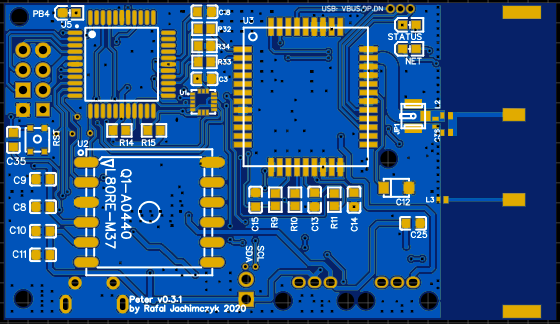
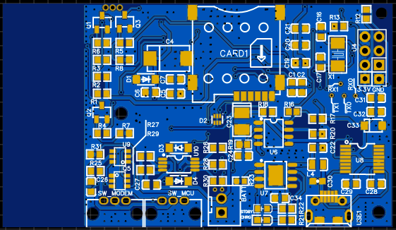

# GPS tracker based on SIM800C GSM module, L80R GPS and MMA8452QR1 Accelerometer

## TL;DR;

This is the main repository containing documentation and code for the GPS tracker device I have built during the 2019-2020. I am not a professional electronic designer, however I was studing electronics during my college years. Professionally I am a Software Engineer with experience in cloud computing, XP practicess and modern programming languages (Node.js and Go). To lern more about me check out [my CV](https://rafaljachimczyk.github.io/markdown-cv/).

This is NOT a production ready product. There are no guarantees nor support is to be expected from myself when you try and build this yourself. I am happy to answer questions though. 

This repo contains only the C++ code for the device itself. Check the other repositories for [iOS app]() and the [Google Cloud functions]() required to run the full project.

## Project goals and intentions

Myself and my partner are a proud "parents" of a lovely dog called Russel. Russel loves to chase various animals that are present in the forests nearby our house. One day on a walk, to our rising panic levels, Russel dissappeared from our sight chasing a deer. We have discussed purchasing a GPS collar for him, but that would be too easy. So I set of on a never ending project to build a GPS tracker, small enough to fit on his collar. 

After a solid year of engineering this is what it looked like : 

[Image of the GPS tracker]

## GPS tracker requirements

- [ ] Small enough to fit on a dog collar
- [ ] Mobile app to see the device on the map
- [ ] Cloud based backend infrastructure
- [ ] Enough battery life to run for 2 days
- [ ] Send additional telemetry for debugging (battery charge, gsm signal strength)
- [ ] Two update modes
    - Continouos (update as fast as possible, when device is moving and app was used within last 5 minutes)
    - Every minute (standard when moving)
- [ ] Sleep mode when the device is not moving

## High level design

The design is not overly complex. The GPS tracker sends the data using Google's [Protocol Buffers](https://developers.google.com/protocol-buffers) over HTTPS. I chose this format as I believed it would make the payloads smaller (binary format) and be lighter on the battery life. The PB endoded data is sent directly to [GCP function](https://cloud.google.com/functions) (equivalent of AWS Lambdas) written in Go, which in turn stores the data in a database. 

I could have gone for gRPC instead of HTTPS but that added extra complexity. I aimed for simplicity for the prototype. 

On the mobile side (iOS app), the code queries another GCP function (also go) using HTTPs, which queries the database. 

## Schematics

I will discuss each part of the schematics to explain design decisions I have made, and the constraints I was working with. 

## PCB

### Main component list

| Subsystem | Component | Comments |
|-----------|-----------------|------------------------|
| MCU       | Atmega644P-20AU | 2 hardware serial ports|
| Battery charger | TP4056 | |
| Battery protection | FS312F | Protect from under/over charge|
| Fuel gauge | DS2782E+ | Measure current |
| LDO Voltage Regulator | TPS77801D | Regulates battery voltage to stable 3.3V |
| GSM | SIM800C | Provides connectivity to the Internet |
| GPS | Quectel L80-R | GPS receiver with patch antenna |

## Power Supply

The GPS tracker is powered by a standard LiPo battery which operates between 3.2v to 4.2v. Any lower and the battery will be irreversably damaged, any higher - the battery might burst into flames. 

The charging circuitry is built in into the device itself. For this I have chosen the trusted TP4056 iC, allowing for up to 1A charge current. Additionally we have battery protection IC - the FS312F.

I also wanted to be able to tell the current usage. For this I have used the ds2782e+ fuel gauge iC. 

The device operates on the 3.3V logic levels.
I have used the TPS77801D low drop out voltage regulator (it somes with a handy status output on pin 8, to indicate low input voltage - we can use this to indicate low battery level and swithch off parts of system via MCU). The LDO delivers the power to all but one part of the system - the GSM module is powered directly from the battery, as it has massive peak current usage when communicating with GSM networks. Also the Sim800c operates exactly in the voltage range of the LiPo battery.

### MCU

I have chosen Atmega 644P-20AU because it contains 2 hardware serial ports (more on that below). Another reason for this was that the only previous experience with Microcontrollers I had was with the Arduinio and ESP8266/32 boards. I know there are ARM (and other) MCUs that would probably be much better for this job, but I wanted to use something I was already familiar with.

The number of hardware serial ports was the biggest constraint for me. The GPS and GSM modules use serial interface to communicate with the MCU. I wanted to be able to see Serial Monitor output as well, to debug the device - that would be a third serial port! 

The design decision I made was to use the two hardware ports of Atmega644 for GPS and Serial. The GSM would have to do with SoftwareSerial.

The MCU makes use of the 8MHz crystal. I have chosen this frequency to be able to operate in the 3.3V logic level. 16MHz requires higher voltages (5V) and I wanted to avoid having to convert logic levels of various sensors (which operate on 3.3V) to 5V. This would make the design much more complex. 

# GSM/Internet connectivity

For my first project of this scale I chose SIM800C. It is a very cheap (couple of dollars) chip providing GPRS Internet connectivity. Another rason why I selected it was that there was enough documentation and libraries to make me comfortable to work with it. 

It is quite power hungry though, and peak requiring 2A of current. 

# Software

[] say something about lessons learned, Interrupts, RTOS